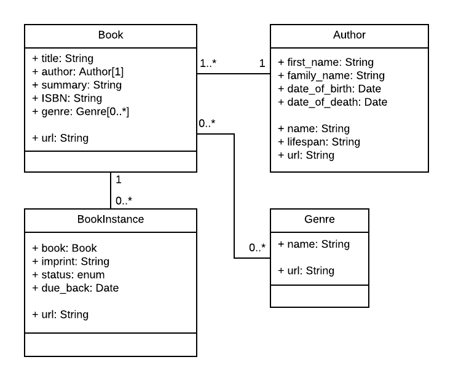
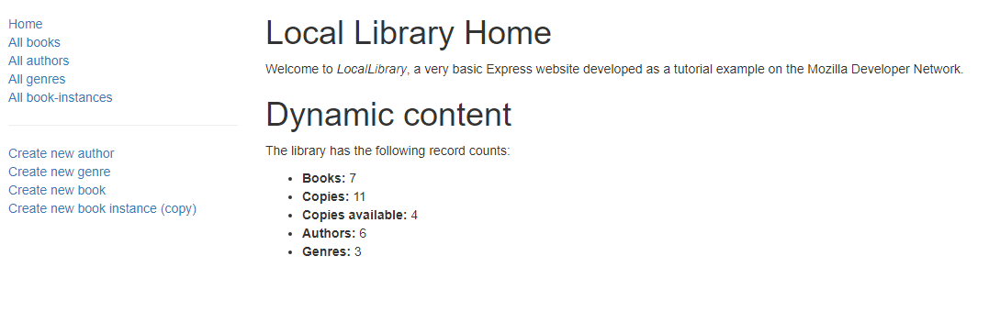
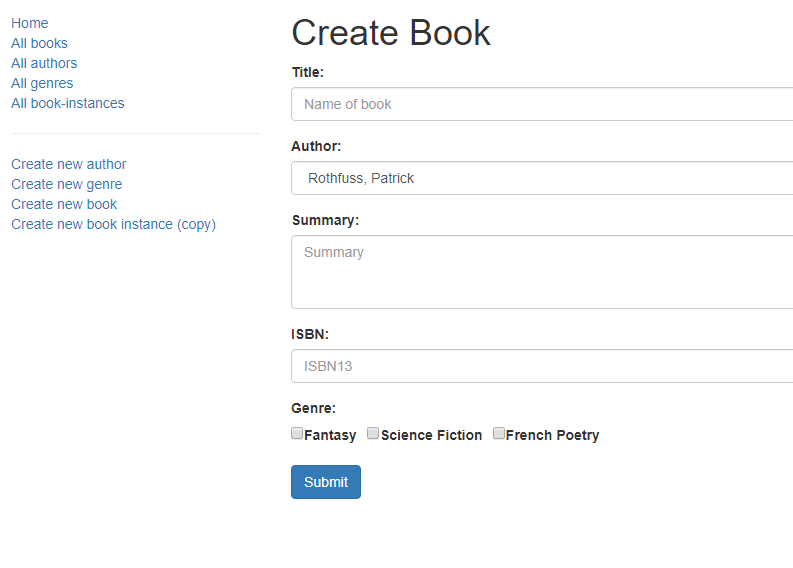
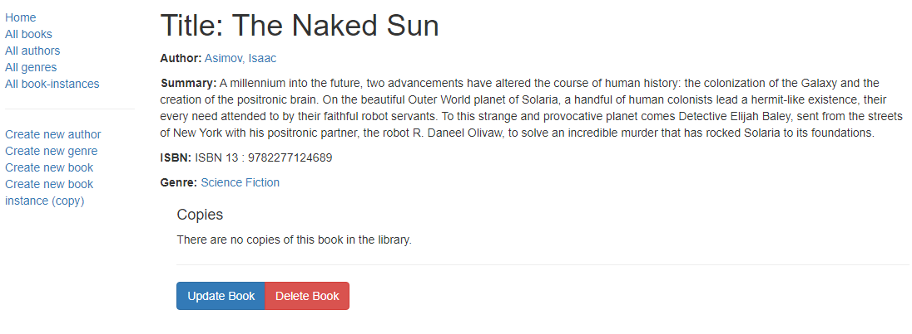

# REST API - Setting up a Node.js development environment with Express.js (using Mongoose ORM / MongoDB Atlas): Libray management

*February 2020*

> 🔨 Library management using Node.js and Express.js. MDN tutorial '[Setting up a Node development environment](https://developer.mozilla.org/en-US/docs/Learn/Server-side/Express_Nodejs/development_environment)'.

See the demo on [Heroku]().

## About

Library management with CRUD. You can add books, genres, authors and book instances.

Read:

Create:

Delete / Update:

------------------

## How to use

### Local

- Clone the [local-version branch](https://github.com/Raigyo/express-locallibrary/tree/local-version)
- Tu run: `DEBUG=express-locallibrary-tutorial:* npm run devstart`
- Open the app using [http://localhost:3000/](http://localhost:3000/)

### Online

See the demo on [Heroku]().

------------------

## Techs and concepts covered

- Routes and controllers (MVC)

- Views with pug templates
- Forms (CRUD) with validation & sanitization

- Using a Database (with Mongoose and MongoDB Atlas)
- Deployment on Heroku

------------------

## Packages used

### -Express.js

Express is a minimal and flexible Node.js web application framework that provides a robust set of features for web and mobile applications.

~~~~
npm install -g express

npm install express-generator -g

express myApp --view=pug

cd myApp

npm install

~~~~
On Windows, use this command:

`SET DEBUG=express-locallibrary-tutorial:* & npm start`

On macOS or Linux, use this command:

`DEBUG=express-locallibrary-tutorial:* npm start`

### -Nodemon

Enable server restart on file changes

~~~~
npm install -g nodemon

npm install --save-dev nodemon

~~~~

Add in package.json:

~~~~
"scripts": {
  "start": "node ./bin/www",
  "devstart": "nodemon ./bin/www",
  "serverstart": "DEBUG=express-locallibrary-tutorial:* npm run devstart"
},
~~~~

On Windows, use this command:

`SET DEBUG=express-locallibrary-tutorial:* & npm run devstart`

On macOS or Linux, use this command:

`DEBUG=express-locallibrary-tutorial:* npm run devstart`

### -Mongoose ORM

Installing Mongoose adds all its dependencies, including the MongoDB database driver.

`npm install mongoose --save`

### -Async

Async is a utility module which provides straight-forward, powerful functions for working with asynchronous JavaScript.

`npm install async --save`

- async.parallel() to execute any operations that must be performed in parallel.
- async.series() for when we need to ensure that asynchronous operations are performed in series.
- async.waterfall() for operations that must be run in series, with each operation depending on the results of preceding operations.

### -Moment

Lightweight JavaScript date library for parsing, validating, manipulating, and formatting dates

`npm install moment --save`

[Date formats documentation](https://momentjs.com/docs/#/displaying/)

### -[populatedb.js](https://raw.githubusercontent.com/hamishwillee/express-locallibrary-tutorial/master/populatedb.js)

`node populatedb '<your atlas mongodb url>'` (don't forget quotes)

(I.E.: *'mongodb+srv://<user>:<password>@cluster0-mbdj7.mongodb.net/<db-name>?retryWrites=true'*)

### -Express-validator

Performs both validation and sanitization of our form data.

`npm install express-validator --save`

- Validation checks that entered values are appropriate for each field (are in the right range, format, etc.) and that values have been supplied for all required fields.
- Sanitization removes/replaces characters in the data that might potentially be used to send malicious content to the server.

### -Helmet

Helmet is a middleware package. It can set appropriate HTTP headers that help protect your app from well-known web vulnerabilities.

`npm install helmet --save`

------------------

## Ressources

- [MDN: Express web framework (Node.js/JavaScript)](https://developer.mozilla.org/en-US/docs/Learn/Server-side/Express_Nodejs)
- [GitHub: express-locallibrary-tutorial](https://github.com/mdn/express-locallibrary-tutorial)
- [MongoDB Atlas](https://www.mongodb.com/cloud/atlas)
- [populatedb.js](https://raw.githubusercontent.com/hamishwillee/express-locallibrary-tutorial/master/populatedb.js)
