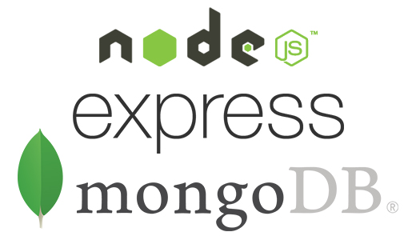

# Setting up a Node.js development environment with Express.js

*February 2020*

> 🔨 xxxxxx. MDN tutorial '[Setting up a Node development environment](https://developer.mozilla.org/en-US/docs/Learn/Server-side/Express_Nodejs/development_environment)'.

## About

xxxxx

To downlon skeleton only (ready to start environment):

~~~~
git clone -b skeleton git@github.com:Raigyo/express-locallibrary.git

npm install
~~~~

------------------

## Techs covered

- xxxxx

------------------

## Packages used

### Express.js

Express is a minimal and flexible Node.js web application framework that provides a robust set of features for web and mobile applications.

~~~~
npm install -g express

npm install express-generator -g

express myApp --view=pug

cd myApp

npm install

~~~~

On Windows, use this command:

`SET DEBUG=express-locallibrary-tutorial:* & npm start`

On macOS or Linux, use this command:

`DEBUG=express-locallibrary-tutorial:* npm start`

### Nodemon

Enable server restart on file changes

~~~~
npm install -g nodemon

npm install --save-dev nodemon

~~~~

Add in package.json:

~~~~
"scripts": {
  "start": "node ./bin/www",
  "devstart": "nodemon ./bin/www",
  "serverstart": "DEBUG=express-locallibrary-tutorial:* npm run devstart"
},
~~~~

On Windows, use this command:

`SET DEBUG=express-locallibrary-tutorial:* & npm run devstart`

On macOS or Linux, use this command:

`DEBUG=express-locallibrary-tutorial:* npm run devstart`

------------------

## Ressources

- [GitHub: express-locallibrary-tutorial](https://github.com/mdn/express-locallibrary-tutorial)
